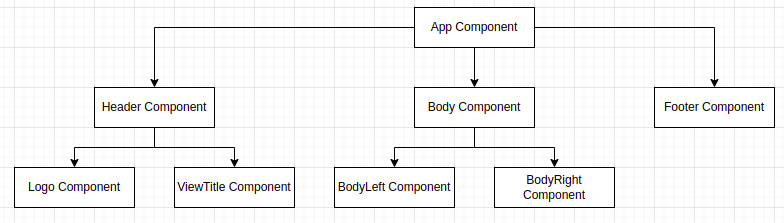
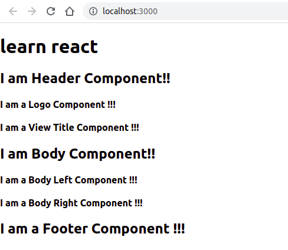

## Objective
This exercise is created to get hands on with creating multiple react components

## To Do
- Fork the boilerplate
- Clone the forked repository to local system
- Open terminal in forked project location and run `npm i` command to install dependency
- Create a folder named `components` under `src` folder.
- Create 7 different components named: `HeaderComponent`, `LogoComponent`, `ViewTitleComponent`, `BodyComponent`, `BodyLeftComponent`, `BodyRightComponent`, and `FooterComponent`
- Component tree will be in below format:

- Final Output of App:

# Submitting your solution for preliminary automated review
- Create a Github Reposistory with React JS Advanced and Day 1 
- Under Assignment repository select Create-React-Component, and branch master
- Under Your solution repository select your own repository and branch
- Press Submit
- Add me sarathanatarajan17@gmail.com as collaborator for your repository.
